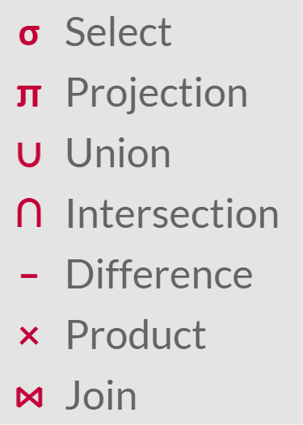
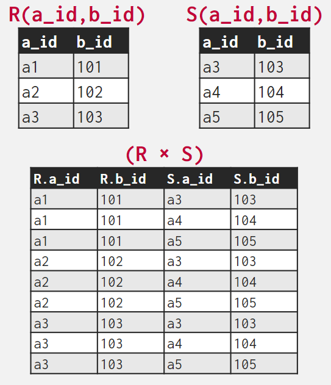
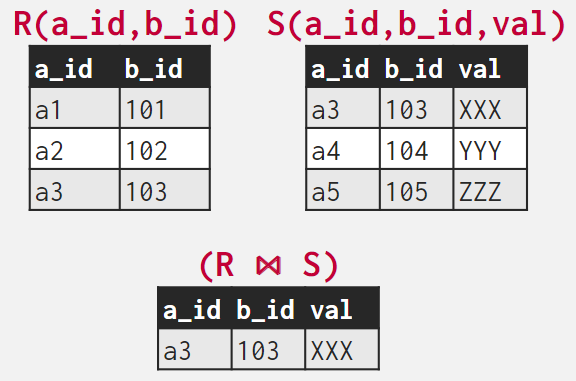

# lecture 1 and 2

> 总结：CMU 15-445 数据库导论的第一节和第二节主要介绍了数据库的概念、数据模型、存储形式、存在问题以及关系模型。

> 习得知识：学会如何使用sql语言进行数据库操作。具体来说，通过`sqlite3`, `DuckDB`等**DBMS**进行数据库操作。

### DataBase(DB) 跟 DataBase Management System(DBMS) 的区别

* DB: 指的是存储数据的集合，包括数据本身和数据结构。
  
* DBMS: 指的是管理 DB 的软件，包括数据库的创建、维护、查询和更新等功能。比如MySQL、Oracle等。

### DB 存储的形式

* comma-separated values (CSV): DB 就被存储在CSV文件中。

* 每一行都是一个实体 (entity)，被逗号分隔的每个部分都是一个属性 (attribute)。

* 应用读取信息需要逐行解析 (parse) 文件。

### 存在问题

1. 效率很低，删、查、改都是`O(n)`的时间复杂度，效率低下。

2. 灵活性低，数据结构不固定，数据模型不统一。

3. 安全性差，数据容易泄露。

4. 并发控制困难，多个用户同时操作同一数据容易造成冲突。

5. 缺少一个抽象层，修改形式往往牵一发而动全身，工作量不易于维护

### 关系模型

* 关系模型(Relational Model)是一种抽象数据模型

它含有三个要点: 

1. 数据库会被简单的数据结构给存储
2. 读取数据需要使用高级语言，并采用合适的策略
3. 由 DBMS 负责物理上的存储

还有三个重要的相关概念: 

1. Structure: 数据库的结构，即数据表的定义
2. Integrity: 数据库的完整性约束
3. Manipulation: 数据库的操作，包括插入、删除、更新等

大概就是说，新的关系模型，有类似模板的作用，可以支持各种各样的数据类型，它这里叫做 tuple。

### Data Manipulation Language (DML)

DML 是关系模型的操作语言，SQL 里面有 SELECT、INSERT、UPDATE、DELETE。

Relational Algebra 是关系模型的代数语言，它可以用来表示关系操作的集合。



对于这样一个表格来说

| a_id | b_id |
|------|------|
| a1   | b1   |
| a2   | b2   |
| a3   | b3   |

1. Select: 从关系中选择数据。筛选 tuples 行。
    ```sql
    SELECT * FROM R WHERE a_id = 'a2'
    ```
    输出
    ```txt
    a_id | b_id 
    a2   | b2   
    ```
2. Projection: 选择特定属性。选择 attributes 列，同时可以对属性进行操作。
    ```sql
    SELECT b_id-100, a_id FROM R WHERE a_id = 'a2'
    ```
    输出
    ```txt
    b_id-100 | a_id
    b2-100   | a2
    ```
3. Union: 取并集，也就是说，给出两个关系(要求必须是同一个attribute)，只要符合其中一个就输出 tuples。
    ```sql
    (SELECT * FROM R) UNION ALL (SELECT * FROM S)
    ```
4. Intersection: 取交集。给出两个关系，只要满足两个关系都满足的 tuples 就输出。
    ```sql
    (SELECT * FROM R) INTERSECT (SELECT * FROM S)
    ```
5. Difference: 取差集。给出两个关系，只要满足第一个关系，但不满足第二个关系的 tuples 就输出。
    ```sql
    (SELECT * FROM R) EXCEPT (SELECT * FROM S)
    ```
6. Product: 笛卡尔积。给出两个关系，输出所有可能的组合。
    ```sql
    1. (SELECT * FROM R) CROSS JOIN (SELECT * FROM S)
    2. SELECT * FROM R, S
    ```
    
7. Join: 连接。给出两个关系，输出满足条件的 tuples。
    ```sql
    SELECT * FROM R JOIN S USING (ATTRIBUTE1, ATTRIBUTE2...)
    ```
    
8. extra operations: 其他操作，比如重命名、分配、去重、聚合、排序等。其中聚合(aggregate)就类似于一个函数，用来对数据进行汇总、筛选。
    