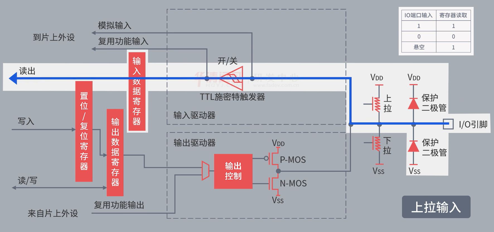
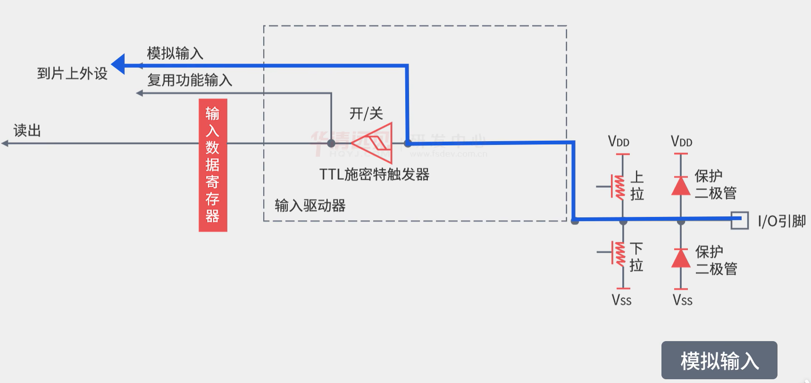
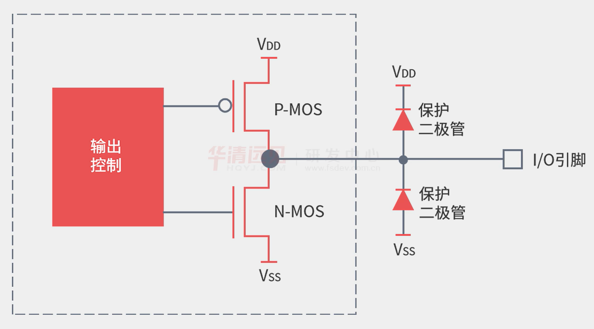
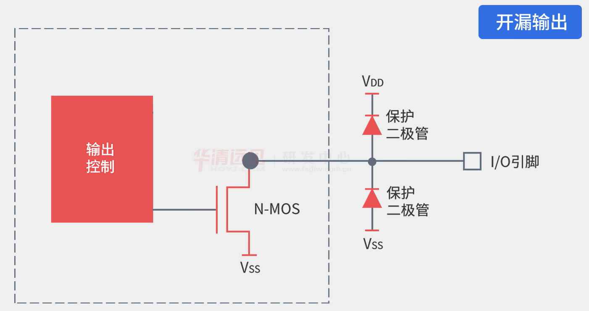

# GPIO

GPIO(General-Purpose Input/Output) 通用输入/输出。GPIO 是一种电子元器件，用于连接电源、信号、控制设备的输入和输出。GPIO 通常用于连接微控制器和外部设备，如显示屏、键盘、鼠标、传感器等。GPIO 通常分为输入和输出两种类型，输入类型用于从外部设备接收信号，输出类型用于向外部设备输出信号。

以下截图都来自这个视频[8分钟动画视频带你直观了解STM32 GPIO接口工作原理，内容很干！GPIO是什么？能用来做什么？八种工作模式，推挽输出和开漏输出的区别---小元实验室](https://www.bilibili.com/video/BV1fu411a74Q/?spm_id_from=333.337.search-card.all.click&vd_source=f53099189814dd887f4ab25638e07406)

~~它的可视化做的是我看过的，讲GPIO的里面做的最好的~~

## 输入

### 上拉输入

> 上拉输入(Pull-up input, PU)

当输入信号比较弱，或者不稳定容易收到干扰的时候采用。因为需要电源高电平的强心针来稳定。

上拉输入是指当没有外部信号时，GPIO 输出高电平。

### 下拉输入

> 下拉输入(Pull-down input, PD)

一般都不用。

下拉输入是指当没有外部信号时，GPIO 输出低电平.

### 浮空输入

> 浮空输入(Floating input, FLO)

芯片复位的默认输入方式就是浮空输入，也最常用的模式。

浮空输入读取的电位不确定。缺点是当没有外部信号时，端口状态不确定。GPIO 保持高低电平不变。外部信号是什么，GPIO 就输出什么。

### 模拟输入

> 模拟输入(Analog input, AN)

主要是为了实现对外部信号的采集。

## 输出

### 推挽输出

> 推挽输出(Push-pull output, PP)

这个是平时用到最多的

可以输出较大的电流，但是只能输出低电平或高电平，也就是说电压固定，不是0V，就是3.3V。

* 特征: 高电平<->低电平  
  * 高电平: 如果上半部分导通，也就是连接的是VCC，那么输出高电平。
  * 低电平: 如果下半部分导通，也就是连接的是GND，那么输出低电平。

### 开漏输出

> 开漏输出(Open-drain output, OD)

如果我们需要更大电流，比如5V，就用开漏输出，外界电源。

* 特征: 低电平<->高阻态 (开漏输出只连下半部分)  
  * 低电平: 如果下半部分导通，也就是连接的是GND，那么输出低电平。
  * 高阻态: 下半部分不导通，此时断开电阻为无穷大，输出高阻态。

### 普通输出和复用输出的区别

按照英文原意来说多了一个multiplexed，意思就是多了一个选择的部分。GPIO除了通用IO引脚，还有复用IO引脚，也就是可以选择性地连接到不同的外设。普通输出就是只能连接一个外设，复用输出可以连接多个外设。

所以二者其实大差不差，多了一个复用选择。

### 复用推挽输出

> 复用推挽输出(Multiplexed push-pull output, MPP)

在特殊功能才会用到

### 复用开漏输出

> 复用开漏输出(Multiplexed open-drain output, MOP)

在特殊功能才会用到

## 输出速度

GPIO 输出速度有以下3种：
* 2MHz
* 10MHz
* 50MHz

数值越大，变化速度越快，坡度越陡。可以理解为斜率k。